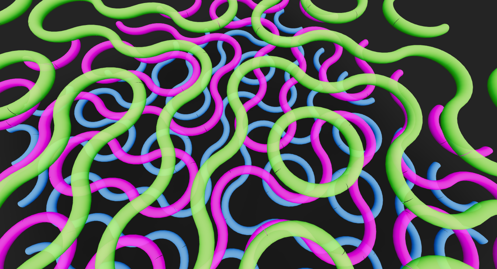

# Various react-three-fiber experiments

Including some modified from the original r3f examples: see credits.

# Truchet tiling demo in react three fiber

(practicing react three fiber)

app bootstrapped with vite react-ts template.



# Relevant material

-   TubeGeometry: https://threejs.org/docs/#api/en/geometries/TubeGeometry

# installation

```
yarn
```

# run

```
yarn dev
```

# Credits

-   Physics1Demo is 99% from Paul Henschel's Simple Physics Demo https://codesandbox.io/s/z8e6m?file=/src/App.js:0-1261
-   Some demos include the font [Anton](https://fonts.google.com/specimen/Anton) from google fonts

# See also

-   [React-three-fiber](https://docs.pmnd.rs/react-three-fiber/)
-   [Drei (helpers)](https://github.com/pmndrs/drei)
    -   OrbitControls
    -   Stage
    -   Float
    -   Text
    -   Text3D
    -   useGLTF
    -   Stars
-   [Post-processing](https://docs.pmnd.rs/react-postprocessing), e.g. [glitch](https://docs.pmnd.rs/react-postprocessing/effects/glitch)
